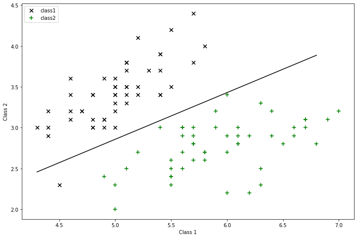

# 逻辑回归

## sigmoid函数
$$
sigmoid(z)=\frac{1}{1+e^{-z}}
$$


```python
def sigmoid(z):
    return 1/(1+np.exp(-z))
```

## 假设函数
$$
h(x)=\Theta_0+\Theta_1x_1+\Theta_2x_2
$$


```python
def predict(theta,X):
    # 预测列表（将预测的值转换为只有0和1的列表，方便最终的绘图）
    h = sigmoid(X * theta.T)
    return [1 if x>=0.5 else 0 for x in h]
```

## 损失函数
利用计算公式带入
$$
J(\Theta)=\frac{1}{m}\sum_{i=1}^{m}\frac{1}{2}(h_\Theta(x^{(i)})-y^{(i)})^2
$$
经过处理以后的损失函数
$$
J(\Theta)=-\frac{1}{m}[\sum_{i=1}^{m}y^{(i)}log h_\Theta(x^{(i)})+(1-y^{(i)})log(1-h_\Theta(x^{(i)}))]
$$
https://blog.csdn.net/code_caq/article/details/69803476


```python
def costFunction(theta,X,y):
    # 将数据均转换为矩阵
    theta = np.matrix(theta)
    X = np.matrix(X)
    y = np.matrix(y)
    
    # 带入公式求解
    part1 = np.multiply(-y,np.log(sigmoid(X*theta.T)))
    part2 = np.multiply(1-y,np.log(1-sigmoid(X*theta.T)))
    return -1*np.sum(part1+part2)/len(X)

def costf(theta,*args):
    X_train,y_train = args
    m,n = X_train.shape
    J = 0
    theta = theta.reshape((n,1))
    h = sigmoid(np.dot(X_train,theta))
    J = -1 * np.sum(y_train * np.log(h) + (1 - y_train) * np.log((1 - h))) / m     
    return J
```

## 梯度下降函数
使用函数：
$$
\Theta_j = \Theta_j - \alpha\frac{\delta}{\delta\Theta_j}J(\Theta),(j=0,..,n)
$$
推导得到：
$$
\frac{\delta}{\delta\Theta_j}=-\frac{1}{m}\sum_{m=1}^{1}(h_\Theta(X^{(i)})-y^{(i)})x^{(i)}_j
$$
也就是
$$
\Theta_j = \Theta_j + \frac{\alpha}{m}\sum_{m=1}^{1}(h_\Theta(X^{(i)})-y^{(i)})x^{(i)}_j
$$


```python
def gradientDescent(theta,X,y):
    # 转换数据为矩阵
    theta = np.matrix(theta)
    X = np.matrix(X)
    y = np.matrix(y)
    
    # 参数数
    parameters = int(theta.ravel().shape[1])
    # 初始化梯度矩阵
    grad = np.zeros(parameters)
    # 损失值
    error = sigmoid(X* theta.T) - y
    
    for i in range(parameters):
        temp = np.multiply(error,X[:,i])
        grad[i] = np.sum(temp) / len(X)
    return grad

def gradf(theta,*args):
    X_train,y_train = args
    m,n = X_train.shape
    J = 0
    theta = theta.reshape((n,1))
    # 矩阵点乘
    h = sigmoid(np.dot(X_train,theta))
    # 初始化梯度值
    grad = np.zeros((X_train.shape[1],1))
    # 计算（矩阵运算，非循环运算）
    grad = X_train.T.dot((h-y_train)) / m
    g = grad.ravel()
    return g
```

## 主要方法
1. 导入数据
2. 初始化参数
3. 设置并带入迭代次数和学习率
4. 求$\Theta$

## 导入数据集


```python
def loadDataSet():
    iris = load_iris()
    feathers = iris.data
    f = feathers[:,:2]
    labels = iris.target
    data = np.insert(f,len(f[0]),labels,axis=1)
    return data[np.where(data[:,-1]!=2)]
```

## 绘图


```python
def plotData(data):
    class1 = data[np.where(data[:,-1]==0)]
    class2 = data[np.where(data[:,-1]==1)]
    fg,ax = plt.subplots(figsize=(12,8))
    ax.scatter(class1[:,0],class1[:,1],s=50,c='black',marker='x',label='class1')
    ax.scatter(class2[:,0],class2[:,1],s=50,c='green',marker='+',label='class2')
    ax.legend()
    ax.set_xlabel('Class 1')
    ax.set_ylabel('Class 2')
    plt.show()
    
def plotDescisionBoundary(data,theta,X):
    class1 = data[np.where(data[:,-1]==0)]
    class2 = data[np.where(data[:,-1]==1)]
    fg,ax = plt.subplots(figsize=(12,8))
    ax.scatter(class1[:,0],class1[:,1],s=50,c='black',marker='x',label='class1')
    ax.scatter(class2[:,0],class2[:,1],s=50,c='green',marker='+',label='class2')
    ax.legend()
    ax.set_xlabel('Class 1')
    ax.set_ylabel('Class 2')
    
    # 绘制直线：注意取值应该是对应的那个！！！
    min_X = min(X[:,1])
    max_X = max(X[:,1])
    x1 = np.arange(min_X,max_X,0.5)
    x2 = (-theta[0] - theta[1] * x1) / theta[2]
    x2 = np.array(x2.tolist())
    plt.plot(x1,x2,color="black")
    plt.legend(loc='upper left')
    plt.show()
```

## 梯度下降函数


```python
def stocGradAscent(X,y):
    m,n = X.shape
    alpha = 0.01
    weights = np.ones(n)
    for i in range(m):
        h = sigmoid(sum(X[i]*weights))
        error = y[i] - h
        weights = weights + alpha * error * X[i]
    return weights

def gradAscent(X,y):
    X = np.mat(X)
    y = np.mat(y).T
    
    m,n = np.shape(X)
    alpha = 0.001
    iterations = 1000
    weights = np.ones((n,1))
    for k in range(iterations):
        h = sigmoid(X*weights)
        error = (y-h)
        weights = weights + alpha * X.T*error
    return weights
```

## Main


```python
"""part1 可视化数据集"""
import pandas as pd
import matplotlib.pyplot as plt
import numpy as np
from scipy import optimize
import scipy.optimize as opt
import seaborn as sns
from sklearn import linear_model
from sklearn.metrics import accuracy_score
from sklearn.datasets import load_iris
%matplotlib inline

data = loadDataSet()

# plotData(data)

"""part2 逻辑回归"""
cols = data.shape[1]
X = data[:,:cols-1]
y = data[:,-1]
X = np.insert(X,0,values=[1],axis=1)

# 初始化参数
theta = np.zeros(3)
"""part3 训练集预测验证"""
theta = gradAscent(X,y)

"""part4 决策边界"""
theta = theta.reshape(1,3).tolist()[0]
plotDescisionBoundary(data,theta,X)
```





## 10k交叉验证


```python
def predict(X,theta):
    h = sigmoid(X * theta)
    return [1 if x >= 0.5 else 0 for x in h]
```


```python
from sklearn.model_selection import KFold
from sklearn.datasets import load_iris
from sklearn.ensemble import RandomForestClassifier
import numpy as np

"""part1 加载数据"""
# 创建分类器
KF = KFold(n_splits=10,shuffle=True,random_state=100)
accuracy_sum = 0
for itrain,itest in KF.split(X):
    # itrain--训练集索引；itest--测试集索引
    X_train = X[itrain]
    y_train = y[itrain]
    
    X_test = X[itest]
    y_test = y[itest]
    # 训练集训练参数
    theta = np.zeros(3)# 初始化参数
    theta = gradAscent(X_train,y_train)
    
    # 测试集用来检验参数
    # 获得经过参数整理后的预测值
    p = np.array(predict(X_test,theta))
    # 预测值与y进行对比
    correct = [1 if ((a == 1 and b == 1) or (a == 0 and b == 0)) else 0 for (a, b) in zip(p, y_test)]
    accuracy = (sum(map(int, correct)) / len(correct))*100
    accuracy_sum += accuracy
print('accuracy = {0}%'.format(accuracy_sum/10.0))
```

    accuracy = 99.0%
    
