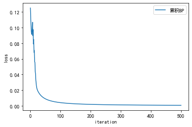

# BP算法
实现标准BP算法和累积BP算法，在西瓜数据集3.0上分别用这两个算法训练一个单隐层网络，并进行比较。

## 导包


```python
import pandas as pd
import numpy as np
from sklearn.preprocessing import LabelEncoder
from sklearn.preprocessing import StandardScaler
import matplotlib.pyplot as plt
seed = 2020
import random
%matplotlib inline
np.random.seed(seed)  # Numpy module.
random.seed(seed)  # Python random module.

plt.rcParams['font.sans-serif'] = ['SimHei'] #用来正常显示中文标签
plt.rcParams['axes.unicode_minus'] = False #用来正常显示负号
plt.close('all')
```

## 数据预处理

### 数据整理


```python
def preprocess(data):
    #将非数映射数字
    ##遍历数据中的列索引
    for title in data.columns:
        ## 为字符类型，各个字段转换为（0-n-1）的值，n为特征值种数
        if data[title].dtype=='object':
            encoder = LabelEncoder()
            data[title] = encoder.fit_transform(data[title])         
    #去均值和方差归一化
    ## 归一化公式：X_scaled = (X - X.mean()) / X.std()
    ss = StandardScaler()
    X = data.drop('好瓜',axis=1) # 数据列
    Y = data['好瓜'] # 标签列
    X = ss.fit_transform(X)
    # 这样写不香嘛
    x = np.array(X);y = np.array(Y).reshape(Y.shape[0],1)
    return x,y
```

### sigmoid函数以及求导
$$
f(x)' = f(x)f(1-x)
$$


```python
#定义Sigmoid 
def sigmoid(x):
    return 1/(1+np.exp(-x))
#求导
def b_sigmoid(x):
    return x*(1-x)
```

## 累积BP算法


```python
def accumulate_BP(x,y,dim=10,eta=0.8,max_iter=500):
    n_samples = x.shape[0] # 17
    w1 = np.zeros((x.shape[1],dim)) # 8x10
    b1 = np.zeros((n_samples,dim)) # 17x10
    
    w2 = np.zeros((dim,1)) # 10x1
    b2 = np.zeros((n_samples,1)) # 17x1
    losslist = []
    for ite in range(max_iter):
        ## FP  
        ### 1
        u1 = np.dot(x,w1)+b1 # 17X8 .* 8X10 -> 17X10
        out1 = sigmoid(u1) # 17x10
        ### 2
        u2 = np.dot(out1,w2)+b2 # 17X10 .* 10X1 -> 17X1 + 17X1
        out2 = sigmoid(u2)
        
        # sum((y-h)^(.5))/2m
        loss = np.mean(np.square(y - out2))/2
        losslist.append(loss)
        print('iter:%d  loss:%.4f'%(ite,loss))
        #补充反向传播代码
        ##BP
        ### 2
        b_out2 = -(y-out2) # 17x1
        b_u2 = b_out2*b_sigmoid(out2) # 17x1
        b_w2 = np.dot(out1.T,b_u2) # 10x17 .* 17x1 = 10x1
        b_b2 = b_u2 # 17x1
        ### 1
        b_out1 = np.dot(b_u2,w2.T) # 17x1 .* 1x10 -> 17x10
        b_u1 = b_out1*b_sigmoid(out1) # 17x10
        b_w1 = np.dot(x.T,b_u1) # 18x17 .* 17x10
        b_b1 = b_u1 # 17x10
        ##更新
        w1 = w1 - eta*b_w1
        w2 = w2 - eta*b_w2
        b1 = b1 - eta*b_b1
        b2 = b2 - eta*b_b2
    plt.figure()
    ##补充Loss可视化代码
    x_test = [i+1 for i in range(max_iter)]
    plt.plot(x_test,losslist)
    plt.legend(['累积BP'])
    plt.xlabel('iteration')
    plt.ylabel('loss')
    plt.show()
    return w1,w2,b1,b2
```

## 标准BP算法


```python
def standard_BP(x,y,dim=10,eta=0.8,max_iter=500): 
    n_samples = 1
    w1 = np.zeros((x.shape[1],dim))
    b1 = np.zeros((n_samples,dim))
    w2 = np.zeros((dim,1))
    b2 = np.zeros((n_samples,1))
    losslist = []
    #补充标准BP算法代码
    # 和上面一样，先FP再BP
    for i in range(max_iter):
        loss_periteration = []
        for m in range(x.shape[0]):# 按照列数遍历
            xi = x[m,:]
            yi = y[m,:]
            xi = x1.reshape(1,xi.shape[0])
            yi = y1.reshape(1,yi.shape[0])
            
            ## FP
            ###1
            u1 = np.dot(xi,w1)+b1
            out1 = sigmoid(u1)
            ###2
            u2 = np.dot(out,w2)+b2
            out2 = sigmoid(u2)
            loss = np.square(yi-out2)/2
            loss_periteration.append(loss)
            print('循环次数：',i,"损失值：",loss)
            
            ##BP
            ### 2
            b_out2 = -(yi - out2)
            b_u2 = b_out2*b_sigmoid(out2)
            b_w2 = np.dot(np.transpose(out1),b_u2)
            b_b2 = b_u2
            ### 1
            b_out1 = np.dot(b_u2,np.transpose(w2))
            b_u1 = b_out1*b_sigmoid(out1)
            b_w1 = np.dot(np.transpose(xi),b_u1)
            b_b1 = b_u1
            
            ## update -= \alpha*导数
            w1 = w1 - eta*b_w1
            w2 = w2 - eta*b_w2
            b1 = b1 - eta*b_b1
            b2 = b2 - eta*b_b2
        losslist.append(np.mean(loss_periteration))
    #补充Loss可视化代码
    plt.figure()
    x_test = [i+1 for i in range(max_iter)]
    plt.plot(x_test,losslist)
    plt.legend(['标准BP'])
    plt.xlabel('iteration')
    plt.ylabel('loss')
    plt.show()
    
    return w1,w2,b1,b2
```

## 测试


```python
data = pd.read_table('watermelon30.txt',delimiter=',')
data.drop('编号',axis=1,inplace=True)
x,y = preprocess(data)
dim = 10

w1,w2,b1,b2 = accumulate_BP(x,y,dim)
#补充测试代码，根据当前的x，预测其类别；
```

    iter:0  loss:0.1250
    iter:1  loss:0.1132
    iter:2  loss:0.1031
    iter:3  loss:0.0954
    iter:4  loss:0.0913
    iter:5  loss:0.0942
    iter:6  loss:0.0982
    iter:7  loss:0.1068
    iter:8  loss:0.0896
    iter:9  loss:0.0974
    iter:10  loss:0.0790
    iter:11  loss:0.0849
    iter:12  loss:0.0682
    iter:13  loss:0.0708
    iter:14  loss:0.0564
    iter:15  loss:0.0555
    iter:16  loss:0.0441
    iter:17  loss:0.0408
    iter:18  loss:0.0330
    iter:19  loss:0.0294
    iter:20  loss:0.0254
    iter:21  loss:0.0232
    iter:22  loss:0.0215
    iter:23  loss:0.0204
    iter:24  loss:0.0194
    iter:25  loss:0.0186
    iter:26  loss:0.0179
    iter:27  loss:0.0172
    iter:28  loss:0.0166
    iter:29  loss:0.0160
    iter:30  loss:0.0154
    iter:31  loss:0.0149
    iter:32  loss:0.0144
    iter:33  loss:0.0140
    iter:34  loss:0.0135
    iter:35  loss:0.0131
    iter:36  loss:0.0127
    iter:37  loss:0.0123
    iter:38  loss:0.0120
    iter:39  loss:0.0117
    iter:40  loss:0.0113
    iter:41  loss:0.0110
    iter:42  loss:0.0108
    iter:43  loss:0.0105
    iter:44  loss:0.0102
    iter:45  loss:0.0100
    iter:46  loss:0.0097
    iter:47  loss:0.0095
    iter:48  loss:0.0093
    iter:49  loss:0.0091
    iter:50  loss:0.0089
    iter:51  loss:0.0087
    iter:52  loss:0.0085
    iter:53  loss:0.0083
    iter:54  loss:0.0081
    iter:55  loss:0.0080
    iter:56  loss:0.0078
    iter:57  loss:0.0077
    iter:58  loss:0.0075
    iter:59  loss:0.0074
    iter:60  loss:0.0072
    iter:61  loss:0.0071
    iter:62  loss:0.0070
    iter:63  loss:0.0068
    iter:64  loss:0.0067
    iter:65  loss:0.0066
    iter:66  loss:0.0065
    iter:67  loss:0.0064
    iter:68  loss:0.0063
    iter:69  loss:0.0062
    iter:70  loss:0.0061
    iter:71  loss:0.0060
    iter:72  loss:0.0059
    iter:73  loss:0.0058
    iter:74  loss:0.0057
    iter:75  loss:0.0056
    iter:76  loss:0.0055
    iter:77  loss:0.0055
    iter:78  loss:0.0054
    iter:79  loss:0.0053
    iter:80  loss:0.0052
    iter:81  loss:0.0052
    iter:82  loss:0.0051
    iter:83  loss:0.0050
    iter:84  loss:0.0049
    iter:85  loss:0.0049
    iter:86  loss:0.0048
    iter:87  loss:0.0048
    iter:88  loss:0.0047
    iter:89  loss:0.0046
    iter:90  loss:0.0046
    iter:91  loss:0.0045
    iter:92  loss:0.0045
    iter:93  loss:0.0044
    iter:94  loss:0.0044
    iter:95  loss:0.0043
    iter:96  loss:0.0043
    iter:97  loss:0.0042
    iter:98  loss:0.0042
    iter:99  loss:0.0041
    iter:100  loss:0.0041
    iter:101  loss:0.0040
    iter:102  loss:0.0040
    iter:103  loss:0.0039
    iter:104  loss:0.0039
    iter:105  loss:0.0038
    iter:106  loss:0.0038
    iter:107  loss:0.0038
    iter:108  loss:0.0037
    iter:109  loss:0.0037
    iter:110  loss:0.0036
    iter:111  loss:0.0036
    iter:112  loss:0.0036
    iter:113  loss:0.0035
    iter:114  loss:0.0035
    iter:115  loss:0.0035
    iter:116  loss:0.0034
    iter:117  loss:0.0034
    iter:118  loss:0.0034
    iter:119  loss:0.0033
    iter:120  loss:0.0033
    iter:121  loss:0.0033
    iter:122  loss:0.0032
    iter:123  loss:0.0032
    iter:124  loss:0.0032
    iter:125  loss:0.0032
    iter:126  loss:0.0031
    iter:127  loss:0.0031
    iter:128  loss:0.0031
    iter:129  loss:0.0030
    iter:130  loss:0.0030
    iter:131  loss:0.0030
    iter:132  loss:0.0030
    iter:133  loss:0.0029
    iter:134  loss:0.0029
    iter:135  loss:0.0029
    iter:136  loss:0.0029
    iter:137  loss:0.0028
    iter:138  loss:0.0028
    iter:139  loss:0.0028
    iter:140  loss:0.0028
    iter:141  loss:0.0028
    iter:142  loss:0.0027
    iter:143  loss:0.0027
    iter:144  loss:0.0027
    iter:145  loss:0.0027
    iter:146  loss:0.0026
    iter:147  loss:0.0026
    iter:148  loss:0.0026
    iter:149  loss:0.0026
    iter:150  loss:0.0026
    iter:151  loss:0.0025
    iter:152  loss:0.0025
    iter:153  loss:0.0025
    iter:154  loss:0.0025
    iter:155  loss:0.0025
    iter:156  loss:0.0025
    iter:157  loss:0.0024
    iter:158  loss:0.0024
    iter:159  loss:0.0024
    iter:160  loss:0.0024
    iter:161  loss:0.0024
    iter:162  loss:0.0024
    iter:163  loss:0.0023
    iter:164  loss:0.0023
    iter:165  loss:0.0023
    iter:166  loss:0.0023
    iter:167  loss:0.0023
    iter:168  loss:0.0023
    iter:169  loss:0.0022
    iter:170  loss:0.0022
    iter:171  loss:0.0022
    iter:172  loss:0.0022
    iter:173  loss:0.0022
    iter:174  loss:0.0022
    iter:175  loss:0.0022
    iter:176  loss:0.0021
    iter:177  loss:0.0021
    iter:178  loss:0.0021
    iter:179  loss:0.0021
    iter:180  loss:0.0021
    iter:181  loss:0.0021
    iter:182  loss:0.0021
    iter:183  loss:0.0021
    iter:184  loss:0.0020
    iter:185  loss:0.0020
    iter:186  loss:0.0020
    iter:187  loss:0.0020
    iter:188  loss:0.0020
    iter:189  loss:0.0020
    iter:190  loss:0.0020
    iter:191  loss:0.0020
    iter:192  loss:0.0019
    iter:193  loss:0.0019
    iter:194  loss:0.0019
    iter:195  loss:0.0019
    iter:196  loss:0.0019
    iter:197  loss:0.0019
    iter:198  loss:0.0019
    iter:199  loss:0.0019
    iter:200  loss:0.0019
    iter:201  loss:0.0018
    iter:202  loss:0.0018
    iter:203  loss:0.0018
    iter:204  loss:0.0018
    iter:205  loss:0.0018
    iter:206  loss:0.0018
    iter:207  loss:0.0018
    iter:208  loss:0.0018
    iter:209  loss:0.0018
    iter:210  loss:0.0018
    iter:211  loss:0.0017
    iter:212  loss:0.0017
    iter:213  loss:0.0017
    iter:214  loss:0.0017
    iter:215  loss:0.0017
    iter:216  loss:0.0017
    iter:217  loss:0.0017
    iter:218  loss:0.0017
    iter:219  loss:0.0017
    iter:220  loss:0.0017
    iter:221  loss:0.0017
    iter:222  loss:0.0017
    iter:223  loss:0.0016
    iter:224  loss:0.0016
    iter:225  loss:0.0016
    iter:226  loss:0.0016
    iter:227  loss:0.0016
    iter:228  loss:0.0016
    iter:229  loss:0.0016
    iter:230  loss:0.0016
    iter:231  loss:0.0016
    iter:232  loss:0.0016
    iter:233  loss:0.0016
    iter:234  loss:0.0016
    iter:235  loss:0.0015
    iter:236  loss:0.0015
    iter:237  loss:0.0015
    iter:238  loss:0.0015
    iter:239  loss:0.0015
    iter:240  loss:0.0015
    iter:241  loss:0.0015
    iter:242  loss:0.0015
    iter:243  loss:0.0015
    iter:244  loss:0.0015
    iter:245  loss:0.0015
    iter:246  loss:0.0015
    iter:247  loss:0.0015
    iter:248  loss:0.0015
    iter:249  loss:0.0015
    iter:250  loss:0.0014
    iter:251  loss:0.0014
    iter:252  loss:0.0014
    iter:253  loss:0.0014
    iter:254  loss:0.0014
    iter:255  loss:0.0014
    iter:256  loss:0.0014
    iter:257  loss:0.0014
    iter:258  loss:0.0014
    iter:259  loss:0.0014
    iter:260  loss:0.0014
    iter:261  loss:0.0014
    iter:262  loss:0.0014
    iter:263  loss:0.0014
    iter:264  loss:0.0014
    iter:265  loss:0.0014
    iter:266  loss:0.0014
    iter:267  loss:0.0013
    iter:268  loss:0.0013
    iter:269  loss:0.0013
    iter:270  loss:0.0013
    iter:271  loss:0.0013
    iter:272  loss:0.0013
    iter:273  loss:0.0013
    iter:274  loss:0.0013
    iter:275  loss:0.0013
    iter:276  loss:0.0013
    iter:277  loss:0.0013
    iter:278  loss:0.0013
    iter:279  loss:0.0013
    iter:280  loss:0.0013
    iter:281  loss:0.0013
    iter:282  loss:0.0013
    iter:283  loss:0.0013
    iter:284  loss:0.0013
    iter:285  loss:0.0013
    iter:286  loss:0.0012
    iter:287  loss:0.0012
    iter:288  loss:0.0012
    iter:289  loss:0.0012
    iter:290  loss:0.0012
    iter:291  loss:0.0012
    iter:292  loss:0.0012
    iter:293  loss:0.0012
    iter:294  loss:0.0012
    iter:295  loss:0.0012
    iter:296  loss:0.0012
    iter:297  loss:0.0012
    iter:298  loss:0.0012
    iter:299  loss:0.0012
    iter:300  loss:0.0012
    iter:301  loss:0.0012
    iter:302  loss:0.0012
    iter:303  loss:0.0012
    iter:304  loss:0.0012
    iter:305  loss:0.0012
    iter:306  loss:0.0012
    iter:307  loss:0.0012
    iter:308  loss:0.0011
    iter:309  loss:0.0011
    iter:310  loss:0.0011
    iter:311  loss:0.0011
    iter:312  loss:0.0011
    iter:313  loss:0.0011
    iter:314  loss:0.0011
    iter:315  loss:0.0011
    iter:316  loss:0.0011
    iter:317  loss:0.0011
    iter:318  loss:0.0011
    iter:319  loss:0.0011
    iter:320  loss:0.0011
    iter:321  loss:0.0011
    iter:322  loss:0.0011
    iter:323  loss:0.0011
    iter:324  loss:0.0011
    iter:325  loss:0.0011
    iter:326  loss:0.0011
    iter:327  loss:0.0011
    iter:328  loss:0.0011
    iter:329  loss:0.0011
    iter:330  loss:0.0011
    iter:331  loss:0.0011
    iter:332  loss:0.0011
    iter:333  loss:0.0011
    iter:334  loss:0.0010
    iter:335  loss:0.0010
    iter:336  loss:0.0010
    iter:337  loss:0.0010
    iter:338  loss:0.0010
    iter:339  loss:0.0010
    iter:340  loss:0.0010
    iter:341  loss:0.0010
    iter:342  loss:0.0010
    iter:343  loss:0.0010
    iter:344  loss:0.0010
    iter:345  loss:0.0010
    iter:346  loss:0.0010
    iter:347  loss:0.0010
    iter:348  loss:0.0010
    iter:349  loss:0.0010
    iter:350  loss:0.0010
    iter:351  loss:0.0010
    iter:352  loss:0.0010
    iter:353  loss:0.0010
    iter:354  loss:0.0010
    iter:355  loss:0.0010
    iter:356  loss:0.0010
    iter:357  loss:0.0010
    iter:358  loss:0.0010
    iter:359  loss:0.0010
    iter:360  loss:0.0010
    iter:361  loss:0.0010
    iter:362  loss:0.0010
    iter:363  loss:0.0010
    iter:364  loss:0.0010
    iter:365  loss:0.0010
    iter:366  loss:0.0009
    iter:367  loss:0.0009
    iter:368  loss:0.0009
    iter:369  loss:0.0009
    iter:370  loss:0.0009
    iter:371  loss:0.0009
    iter:372  loss:0.0009
    iter:373  loss:0.0009
    iter:374  loss:0.0009
    iter:375  loss:0.0009
    iter:376  loss:0.0009
    iter:377  loss:0.0009
    iter:378  loss:0.0009
    iter:379  loss:0.0009
    iter:380  loss:0.0009
    iter:381  loss:0.0009
    iter:382  loss:0.0009
    iter:383  loss:0.0009
    iter:384  loss:0.0009
    iter:385  loss:0.0009
    iter:386  loss:0.0009
    iter:387  loss:0.0009
    iter:388  loss:0.0009
    iter:389  loss:0.0009
    iter:390  loss:0.0009
    iter:391  loss:0.0009
    iter:392  loss:0.0009
    iter:393  loss:0.0009
    iter:394  loss:0.0009
    iter:395  loss:0.0009
    iter:396  loss:0.0009
    iter:397  loss:0.0009
    iter:398  loss:0.0009
    iter:399  loss:0.0009
    iter:400  loss:0.0009
    iter:401  loss:0.0009
    iter:402  loss:0.0009
    iter:403  loss:0.0009
    iter:404  loss:0.0009
    iter:405  loss:0.0008
    iter:406  loss:0.0008
    iter:407  loss:0.0008
    iter:408  loss:0.0008
    iter:409  loss:0.0008
    iter:410  loss:0.0008
    iter:411  loss:0.0008
    iter:412  loss:0.0008
    iter:413  loss:0.0008
    iter:414  loss:0.0008
    iter:415  loss:0.0008
    iter:416  loss:0.0008
    iter:417  loss:0.0008
    iter:418  loss:0.0008
    iter:419  loss:0.0008
    iter:420  loss:0.0008
    iter:421  loss:0.0008
    iter:422  loss:0.0008
    iter:423  loss:0.0008
    iter:424  loss:0.0008
    iter:425  loss:0.0008
    iter:426  loss:0.0008
    iter:427  loss:0.0008
    iter:428  loss:0.0008
    iter:429  loss:0.0008
    iter:430  loss:0.0008
    iter:431  loss:0.0008
    iter:432  loss:0.0008
    iter:433  loss:0.0008
    iter:434  loss:0.0008
    iter:435  loss:0.0008
    iter:436  loss:0.0008
    iter:437  loss:0.0008
    iter:438  loss:0.0008
    iter:439  loss:0.0008
    iter:440  loss:0.0008
    iter:441  loss:0.0008
    iter:442  loss:0.0008
    iter:443  loss:0.0008
    iter:444  loss:0.0008
    iter:445  loss:0.0008
    iter:446  loss:0.0008
    iter:447  loss:0.0008
    iter:448  loss:0.0008
    iter:449  loss:0.0008
    iter:450  loss:0.0008
    iter:451  loss:0.0008
    iter:452  loss:0.0008
    iter:453  loss:0.0008
    iter:454  loss:0.0007
    iter:455  loss:0.0007
    iter:456  loss:0.0007
    iter:457  loss:0.0007
    iter:458  loss:0.0007
    iter:459  loss:0.0007
    iter:460  loss:0.0007
    iter:461  loss:0.0007
    iter:462  loss:0.0007
    iter:463  loss:0.0007
    iter:464  loss:0.0007
    iter:465  loss:0.0007
    iter:466  loss:0.0007
    iter:467  loss:0.0007
    iter:468  loss:0.0007
    iter:469  loss:0.0007
    iter:470  loss:0.0007
    iter:471  loss:0.0007
    iter:472  loss:0.0007
    iter:473  loss:0.0007
    iter:474  loss:0.0007
    iter:475  loss:0.0007
    iter:476  loss:0.0007
    iter:477  loss:0.0007
    iter:478  loss:0.0007
    iter:479  loss:0.0007
    iter:480  loss:0.0007
    iter:481  loss:0.0007
    iter:482  loss:0.0007
    iter:483  loss:0.0007
    iter:484  loss:0.0007
    iter:485  loss:0.0007
    iter:486  loss:0.0007
    iter:487  loss:0.0007
    iter:488  loss:0.0007
    iter:489  loss:0.0007
    iter:490  loss:0.0007
    iter:491  loss:0.0007
    iter:492  loss:0.0007
    iter:493  loss:0.0007
    iter:494  loss:0.0007
    iter:495  loss:0.0007
    iter:496  loss:0.0007
    iter:497  loss:0.0007
    iter:498  loss:0.0007
    iter:499  loss:0.0007
    





### y预测
用训练的各个参数进行计算


```python
#1
u1 = np.dot(x,w1)+b1
out1 = sigmoid(u1)
#2
u2 = np.dot(out1,w2)+b2
out2 = sigmoid(u2)
y_pred = np.round(out2)

result = pd.DataFrame(np.hstack((y,y_pred)),columns=['真值','预测'] )
result
```


<div>
<style scoped>
    .dataframe tbody tr th:only-of-type {
        vertical-align: middle;
    }

    .dataframe tbody tr th {
        vertical-align: top;
    }

    .dataframe thead th {
        text-align: right;
    }
</style>
<table border="1" class="dataframe">
  <thead>
    <tr style="text-align: right;">
      <th></th>
      <th>真值</th>
      <th>预测</th>
    </tr>
  </thead>
  <tbody>
    <tr>
      <th>0</th>
      <td>1.0</td>
      <td>1.0</td>
    </tr>
    <tr>
      <th>1</th>
      <td>1.0</td>
      <td>1.0</td>
    </tr>
    <tr>
      <th>2</th>
      <td>1.0</td>
      <td>1.0</td>
    </tr>
    <tr>
      <th>3</th>
      <td>1.0</td>
      <td>1.0</td>
    </tr>
    <tr>
      <th>4</th>
      <td>1.0</td>
      <td>1.0</td>
    </tr>
    <tr>
      <th>5</th>
      <td>1.0</td>
      <td>1.0</td>
    </tr>
    <tr>
      <th>6</th>
      <td>1.0</td>
      <td>1.0</td>
    </tr>
    <tr>
      <th>7</th>
      <td>1.0</td>
      <td>1.0</td>
    </tr>
    <tr>
      <th>8</th>
      <td>0.0</td>
      <td>0.0</td>
    </tr>
    <tr>
      <th>9</th>
      <td>0.0</td>
      <td>0.0</td>
    </tr>
    <tr>
      <th>10</th>
      <td>0.0</td>
      <td>0.0</td>
    </tr>
    <tr>
      <th>11</th>
      <td>0.0</td>
      <td>0.0</td>
    </tr>
    <tr>
      <th>12</th>
      <td>0.0</td>
      <td>0.0</td>
    </tr>
    <tr>
      <th>13</th>
      <td>0.0</td>
      <td>0.0</td>
    </tr>
    <tr>
      <th>14</th>
      <td>0.0</td>
      <td>0.0</td>
    </tr>
    <tr>
      <th>15</th>
      <td>0.0</td>
      <td>0.0</td>
    </tr>
    <tr>
      <th>16</th>
      <td>0.0</td>
      <td>0.0</td>
    </tr>
  </tbody>
</table>
</div>


